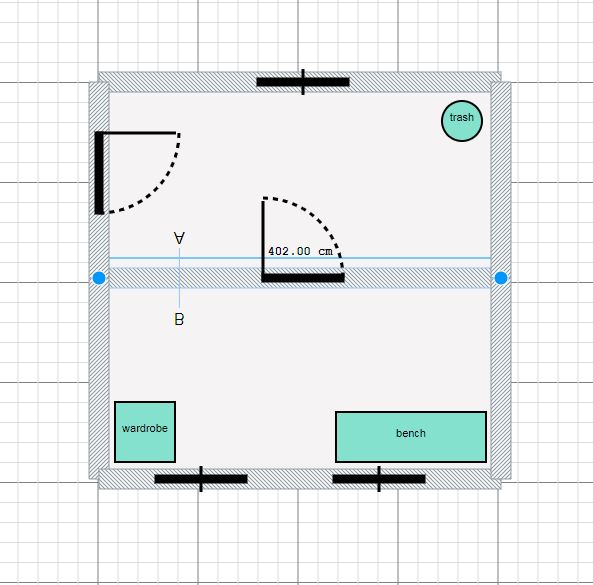
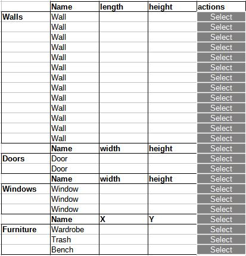
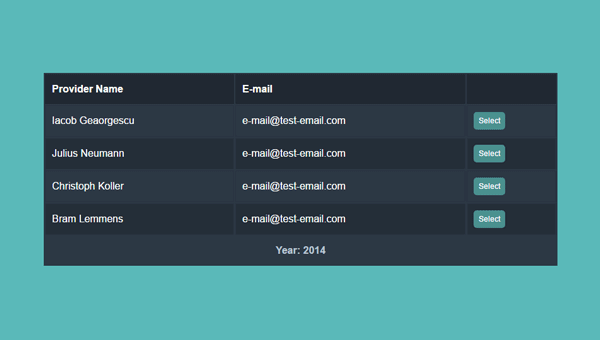

# Task_10-SceneTable
Test task for new candidate

1. Clone repo https://github.com/homyplan/react-planner-test.git which is forked form https://github.com/cvdlab/react-planner
2. Install and run the application
3. Prepare simple room with walls, doors, windows and some furniture
4. 

5. Add a button to the interface which opens the popup window (div) with a table of elements sorted by type
6. Fill the table with some of them properties (listed below)

7. Use CSS to make the table look modern and clean (You can use example below or design Your own).

